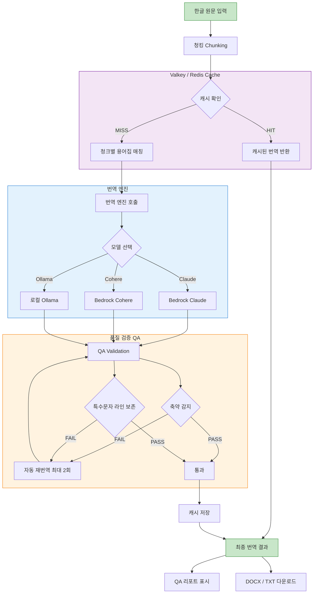

# Korean Novel Translator

한글 소설을 영어로 번역하는 문서 번역 시스템 (DOCX / 텍스트 지원)

## 개요

AWS Bedrock 기반 번역 시스템으로, 다중 모델(Claude, Cohere, Ollama)을 지원하며
프로젝트별 용어집(Glossary) 관리, **번역 품질 자동 검증(QA Validation)**,
**Valkey/Redis 번역 캐시**, **청크별 용어집 최적화** 기능을 포함합니다.

## 아키텍처



## 주요 기능

- **다중 모델 지원**: Claude 4.5 Sonnet, Claude 3.5 Sonnet/Haiku, Cohere Command R/R+, Ollama
- **DOCX 번역**: 문서 업로드 → 번역 → 서식 유지된 DOCX 다운로드
- **프로젝트별 용어집**: Common / Genre / Work 3계층 글로서리 관리
- **프롬프트 버전 관리**: DynamoDB + S3 기반 버전 저장/복원 (자동 프로비저닝)
- **QA Validation**: 번역 품질 자동 검증 + 자동 재번역
- **Valkey/Redis 캐시**: 동일 텍스트 재번역 시 API 호출 스킵
- **청크별 용어집 최적화**: 청크에 등장하는 용어만 전송하여 토큰 절감

## 토큰 비용 최적화

### 1. 청크별 용어집 매칭

기존에는 전체 텍스트에서 매칭된 용어를 모든 청크에 동일하게 전송했습니다.
이제는 각 청크에 실제로 등장하는 용어만 골라서 시스템 프롬프트에 포함합니다.

```
기존: 전체 텍스트에서 15개 매칭 → 모든 청크에 15개 전송
변경: 청크 1에는 5개, 청크 2에는 3개, 청크 3에는 7개만 전송
```

QA 리포트에서 청크별 `Glossary: N terms`로 확인 가능합니다.

### 2. Valkey/Redis 번역 캐시

동일한 텍스트 + 동일한 시스템 프롬프트 + 동일한 모델 조합이면
캐시에서 바로 반환하여 **API 호출 자체를 스킵**합니다.

```
Cache Key = SHA256(model_id + system_prompt + source_text)
```

- **Valkey/Redis 연결 시**: 서버 캐시 (TTL 24시간, 재시작 후에도 유지)
- **연결 실패 시**: 인메모리 캐시로 자동 폴백 (Streamlit 세션 유지)
- **QA 통과한 번역만 캐시**: 불량 번역이 캐시되지 않음
- QA 리포트에서 청크별 `CACHED` / `API` 표시로 확인 가능

**비용 절감 시나리오:**
| 시나리오 | 절감 효과 |
|---------|----------|
| 동일 문서 재번역 (모델/프롬프트 동일) | API 호출 100% 스킵 |
| 반복 등장하는 정형 문구 (캐릭터 소개 등) | 해당 청크 API 호출 스킵 |
| 용어집 수정 후 재번역 | 시스템 프롬프트 변경으로 캐시 미스 → 정상 재번역 |
| 번역 실패 후 재시도 | QA 실패 결과는 캐시 안 됨 → 정상 재번역 |

### 3. 프롬프트 캐싱 호환

시스템 프롬프트 구조가 Bedrock 프롬프트 캐싱과 호환됩니다:

```
┌─────────────────────────────────────────┐
│ BASE_CONTEXT (고정 - 항상 동일)           │  ← Bedrock 캐시 대상
├─────────────────────────────────────────┤
│ GLOSSARY JSON (청크별로 다름)              │  ← 변동 부분 (하단 배치)
├─────────────────────────────────────────┤
│ Style Rules (프로젝트별 고정)              │
└─────────────────────────────────────────┘
```

고정 부분(BASE_CONTEXT)이 앞에 오고, 변동 부분(용어집)이 뒤에 위치하여
Bedrock 프롬프트 캐싱이 활성화되면 고정 부분의 토큰 비용이 자동으로 절감됩니다.

## QA Validation (번역 품질 자동 검증)

대량 번역 시 발생하는 두 가지 주요 이슈를 자동으로 감지하고 대응합니다.

### 이슈 1: 내용 축약 (Summarization)

모델이 긴 텍스트를 번역할 때 원문을 요약하거나 문장을 생략하는 문제입니다.
특히 배치 처리 시 토큰이 길어질수록 축약 경향이 강해집니다.

**3단계 방어 구조:**

```
원문 33줄  →  번역 15줄?  →  비율 0.45  →  FAIL  →  재번역 요청
```

**1단계 — 프롬프트 방어**

시스템 프롬프트(`BASE_CONTEXT`)에 축약 금지를 명시합니다:

```
- NEVER summarize, condense, or abridge the text.
  The output must contain the SAME number of paragraphs and sentences as the input.
- Maintain a strict 1:1 paragraph mapping between source and translation.
```

**2단계 — 라인 수 비율 검증**

`validate_translation()` 함수에서 번역 후 원문/번역의 비어있지 않은 라인 수를 비교합니다:

```python
src_lines = _count_nonempty_lines(source)    # 원문 라인 수
tgt_lines = _count_nonempty_lines(translated) # 번역 라인 수
line_ratio = tgt_lines / src_lines            # 비율 계산

if line_ratio < 0.8:  # 80% 미만이면 축약으로 판단
    → FAIL
```

**3단계 — 자동 재번역 (최대 2회)**

QA 실패 시 `build_retry_prompt()`로 구체적인 문제점을 포함한 강화 프롬프트를 생성하여 재번역합니다:

```
CRITICAL RETRY INSTRUCTION: 이전 번역이 품질 검증에서 거부되었습니다.
ISSUE: 원문 33줄인데 15줄만 번역했습니다. 모든 라인을 생략 없이 번역하세요.
```

### 이슈 2: 특수문자 라인 삭제

한국 웹소설에서 자주 사용하는 특수문자(`《》`, `【】`, `★`, `♡`, `<>`, `[]` 등)가 포함된
라인이 번역 시 통째로 삭제되는 문제입니다. 다이렉트 프롬프트에서는 발생하지 않고
배치(크론) 처리에서만 발생하는 특징이 있었습니다.

**원인 분석:**
- `<`, `>` 같은 문자가 API 전송 시 XML/HTML 태그로 인식되어 파싱 과정에서 제거됨
- 배치 처리와 다이렉트 프롬프트의 메시지 구성 방식 차이

**3단계 방어 구조:**

```
원문: 《시스템 알림》, 【상태창】, ★전투★  →  번역에서 사라졌나?  →  감지  →  재번역
```

**1단계 — API 전처리 (태그 오인식 방지)**

`_safe_text_for_api()` 함수에서 `<`, `>`가 포함된 텍스트를 코드펜스로 감싸
XML/HTML 태그로 파싱되는 것을 방지합니다:

```python
def _safe_text_for_api(text):
    if '<' in text or '>' in text:
        return f"```\n{text}\n```"  # 코드펜스로 감싸서 리터럴 텍스트로 전달
    return text
```

**2단계 — 특수문자 라인 보존 검증**

`validate_translation()` 함수에서 원문의 특수문자 포함 라인을 추출한 뒤,
번역 결과에서 동일한 특수문자가 존재하는지 확인합니다:

```python
_SPECIAL_LINE_RE = re.compile(r'[<>\[\]《》「」『』【】―★☆♡♥◆◇■□▲△▼▽※†‡]')

src_special = _extract_special_lines(source)
# → ["《시스템 알림: 새로운 플레이어...》", "【상태창】", "★ 전투 개시 ★"]

for sline in src_special:
    specials_in_line = _SPECIAL_LINE_RE.findall(sline)  # ['《', '》']
    # 번역 결과의 각 라인에서 동일한 특수문자가 있는지 확인
    found = any(all(ch in tline for ch in specials_in_line)
                for tline in translated.splitlines())
    if not found:
        → 누락으로 기록
```

**3단계 — 재번역 시 누락 라인 명시**

재번역 프롬프트에 정확히 어떤 라인이 누락되었는지 모델에게 알려줍니다:

```
ISSUE: 특수문자가 포함된 라인을 삭제했습니다.
다음 라인이 반드시 번역 결과에 포함되어야 합니다:
  → 《시스템 알림: 새로운 플레이어가 접속했습니다》
  → 【상태창】
  → ★ 전투 개시 ★
```

### QA 리포트 UI

번역 완료 후 항상 QA Validation 리포트가 표시됩니다:

- **요약 배너**: 전체 PASS/FAIL 상태
- **상세 메트릭**: 총 청크 수 / 통과 / 실패 / 재시도 횟수 / 캐시 히트
- **청크별 상세**:
  - `PASS`/`FAIL` + `CACHED`/`API` 상태
  - 원문 라인 수 → 번역 라인 수 (비율)
  - 특수문자 라인 수 / 누락 수
  - 용어집 매칭 수 (Glossary: N terms)
  - 재시도 횟수, 구체적 이슈 내용

### 테스트 샘플

`test_samples/` 디렉토리에 두 가지 테스트 샘플이 포함되어 있습니다:

| 파일 | 목적 | 특징 |
|------|------|------|
| `sample_summarization_test.txt` | 축약 감지 테스트 | 33+ 짧은 문단의 전투 장면, 모델이 합치거나 생략할 가능성 높음 |
| `sample_special_chars_test.txt` | 특수문자 보존 테스트 | `《》`, `【】`, `★`, `♡`, `>>><<<`, `├└` 등 웹소설 특수문자 총집합 |

## 지원 모델

| 모델 | 엔진 | Model ID |
|------|------|----------|
| Claude 4.5 Sonnet | Bedrock | `us.anthropic.claude-sonnet-4-5-20250929-v1:0` |
| Claude 3.5 Sonnet v2 | Bedrock | `us.anthropic.claude-3-5-sonnet-20241022-v2:0` |
| Claude 3.5 Haiku | Bedrock | `us.anthropic.claude-3-5-haiku-20241022-v1:0` |
| Cohere Command R+ | Bedrock | `cohere.command-r-plus-v1:0` |
| Cohere Command R | Bedrock | `cohere.command-r-v1:0` |
| Ollama dolphin-llama3 | Local | `dolphin-llama3:8b` |

## 설치 및 실행

### 1. 의존성 설치

```bash
pip install -r requirements.txt
```

### 2. AWS 자격증명 설정

```bash
aws configure
```

### 3. 환경변수 설정

```bash
cp .env.sample .env
```

`.env` 파일 설정 항목:

```bash
# S3 (용어집 버전 저장) — 미설정 시 'my-translation-prompts' 자동 생성
PROMPT_S3_BUCKET=

# DynamoDB (버전 메타데이터) — 미설정 시 'translator' 자동 생성
PROMPT_DYNAMO_TABLE=

# AWS Region — 기본값: ap-northeast-2
PROMPT_AWS_REGION=

# Valkey/Redis 캐시 — 미설정 시 인메모리 캐시 사용
# 로컬: redis://localhost:6379/0
# AWS ElastiCache: rediss://my-cluster.xxxxx.cache.amazonaws.com:6379/0
VALKEY_URL=
```

S3 버킷과 DynamoDB 테이블은 **앱 첫 실행 시 자동 생성**됩니다.
수동 프로비저닝이 필요한 경우 `deploy.sh`를 실행하세요.

### 4. Valkey/Redis 설치 (선택)

```bash
# macOS (로컬 개발)
brew install valkey
brew services start valkey

# 또는 Docker
docker run -d --name valkey -p 6379:6379 valkey/valkey:latest
```

Valkey 없이도 앱은 정상 동작합니다 (인메모리 캐시 폴백).

### 5. 앱 실행

```bash
streamlit run app_docx_translator.py
```

브라우저에서 http://localhost:8501 접속

## 프로젝트 구조

```
translate_content/
├── app_docx_translator.py     # 메인 애플리케이션 (QA + 캐시 + 청크별 용어집)
├── app_translator.py          # 텍스트 전용 번역기
├── app.py                     # 레거시 투트랙 번역기
├── glossary_manager.py        # 용어집 관리 모듈
├── prompt_store.py            # 프롬프트 버전 관리 (DynamoDB + S3, 자동 프로비저닝)
├── requirements.txt           # Python 의존성
├── .env.sample                # 환경변수 템플릿 (S3, DynamoDB, Valkey)
├── .gitignore                 # Git 제외 설정 (.env 포함)
├── deploy.sh                  # AWS 리소스 수동 프로비저닝 스크립트
├── glossaries/                # 프로젝트별 용어집 데이터
├── test_samples/              # QA 테스트용 샘플 텍스트
│   ├── sample_summarization_test.txt
│   └── sample_special_chars_test.txt
├── backup/                    # 소스코드 백업
└── example/                   # 예제 파일
```

## 버전 히스토리

### v3.1 (2026-03-09)
- Valkey/Redis 번역 캐시 추가 (동일 텍스트 재번역 시 API 호출 스킵)
- 청크별 용어집 매칭 (청크에 등장하는 용어만 전송하여 토큰 절감)
- S3 버킷 / DynamoDB 테이블 자동 프로비저닝 (첫 실행 시 자동 생성)
- QA 리포트에 캐시 히트 통계 + 청크별 용어집 매칭 수 표시
- .env.sample에 VALKEY_URL 설정 추가

### v3.0 (2026-03-09)
- QA Validation 기능 추가 (축약 감지 + 특수문자 라인 보존 검증)
- 자동 재번역 로직 (QA 실패 시 최대 2회 재시도)
- QA 리포트 UI (청크별 상세 검증 결과 표시)
- API 전처리: 특수문자 태그 오인식 방지 (`_safe_text_for_api`)
- 시스템 프롬프트 강화 (축약 금지, 특수문자 보존 지시)

### v2.0 (2026-01-17)
- DOCX 파일 업로드/다운로드 지원
- 프로젝트별 3계층 용어집 (Common/Genre/Work)
- 프롬프트 버전 관리 (DynamoDB + S3)
- 배치 번역, 번역 히스토리

### v1.0
- 초기 버전
- 투트랙 번역 로직 (Claude + Cohere)
